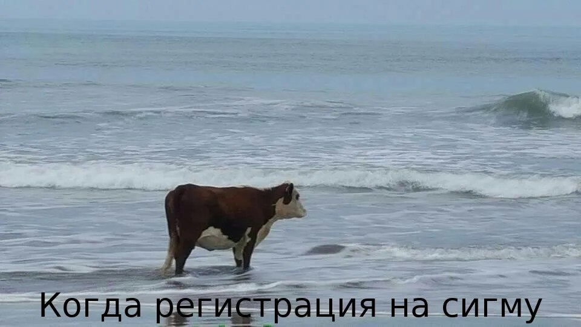

# Генератор мемов

«Генератор мемов» — твой карманный мастер по производству смеха! Выбери картинку, добавь текст и вуаля! — у тебя мем, способный разбудить даже спящего кота! 😛 

💡 Идеально для:
- Унижений в групповом чате,
- Вечерних посиделок с ноутом и печеньками,
- Работы (если вы SMM-щик, конечно😏).

Создавай, смейся, делись.

## Функциональность

Бот должен генерировать мемы, используя изображения и текст. Для этого он берёт изображение и рисует нужный текст внизу этого изображения (пример ниже).

**Основная функциональность:** бот должен поддерживать команду `/generate`, которая и генерирует мемы (в итоге бот присылает сообщение с изображением). Бот должен спросить у пользователя, какой текст вписать в мем.

***Уровни сложности***:
1. *Easy*. Бот рандомно выбирает изображение из своей базы данных изображений.
2. *Medium*. Бот позволяет пользователю выбрать изображение, которое будет использовано для генерации.
3. *Advanced*. Бот позволяет пользователю загружать свои собственные изображения, которые могут быть использованы для генерации.
4. *Advanced+*. Бот позволяет конфигурировать размер текста на изображении, отступ снизу, шрифт и цвет текста.

## Состав команды

Количество участников команды — 2-4 человека в зависимости от уровня сложности реализации.
